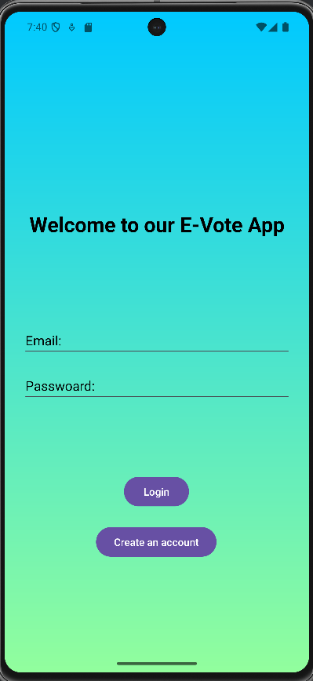
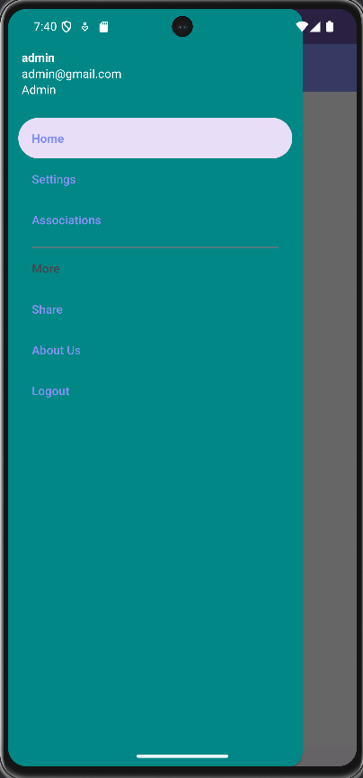
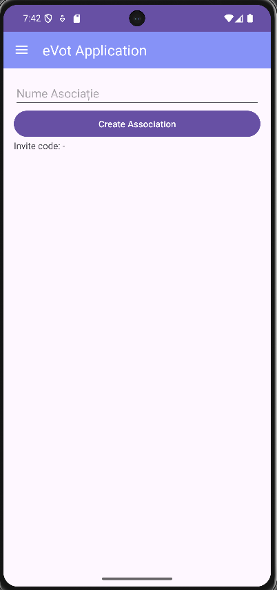
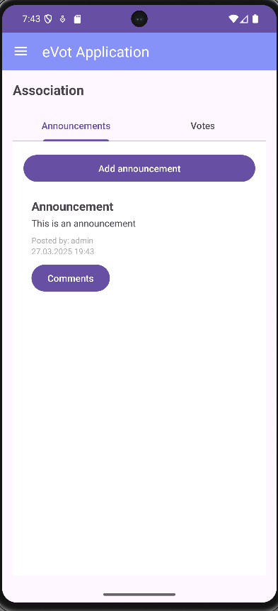
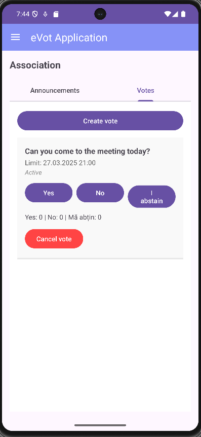

# 🗳️ eVot Application - still in development

An Android app for managing community associations, announcements, and voting.  
Admins can create associations, post announcements, launch polls, and manage users.  
Residents can join associations, view content, comment, and cast votes easily.

---

## 📸 Screenshots - outdated to be changed once the app is fully ready

| Login | Navigation | Create Association |
|-------|------------|--------------------|
|  |  |  |

| Announcements | Voting |
|---------------|--------|
|  |  |

---

## 🔧 Features

### 👥 User Roles:

#### Admin:
- Create associations
- Generate invitation codes
- Post and manage announcements
- Create and cancel polls
- View vote results
- Chating (text , pictures, videos)
- Soon: uploading invoices

#### Resident:
- Join associations via invite code
- View announcements , post comments
- Chating (text , pictures, videos)
- Vote once in each poll (cannot undo vote)
- Cannot edit or cancel polls
- Soon: download and pay invoices

---

## 📦 Built With

- **Kotlin** + **Android Studio**
- **Firebase Authentication**
- **Firebase Firestore**
- **Firebase Storage**
- ViewPager2 + TabLayout
- RecyclerView + Adapters
- Material Design Components
- Data Binding

---

## 🚀 Getting Started

1. Clone the repository:
   ```bash
   git clone https://github.com/EnacheVictor/eVot_Application.git
2. Open it in Android Studio

3. Create a Firebase project and enable:

🔑 Email/Password Authentication

📄 Cloud Firestore Database

Download your google-services.json and place it in the /app folder

Run the app on an emulator or Android device (API 24+ recommended)


⚠️ Note about google-services.json

The google-services.json file included in this repository is inactive and exists only as a placeholder.

🔄 To run the app:

Go to firebase.google.com

Create your own Firebase project

Add an Android app with your package name

Download your own google-services.json

Replace the file inside the /app folder 
   

📜 License
Licensed under the MIT License.   
Free to use, modify, distribute – no liability.

🙌 Credits   
Created with ❤️ by EnacheVictor   
Feel free to fork, remix, or share!
